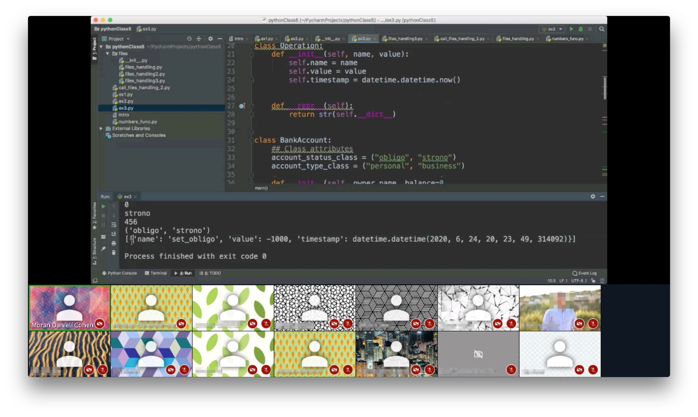

# Top 3 Advanced Python Exercises for Beginners

After many hours of teaching Python, I collected the most interesting and
challenging exercises for Python developers who would like to improve their programming skills and knowledge.

In this repository you'll find the following exercises:
<ol>
    <li><a href="https://github.com/morandanieli/pythonPractice/blob/master/english_dictionary/Instructions.ipynb">English-English Dictionary</a>.</li>
    <li><a href="https://github.com/morandanieli/pythonPractice/blob/master/speed_test/instructions.ipynb">Typing Speed Test</a>.</li>
    <li><a href="https://github.com/morandanieli/pythonPractice/blob/master/memory_management/instructions.ipynb">Memory Managment Helper</a>.</li>
    <li><a href="https://github.com/morandanieli/pythonPractice/blob/master/sudoku/README.md">Automatic Sudoku Solver</a>.</li>
</ol>

All exercises have detailed instructions and a solution.

IMPORTANT IMPORTANT IMPORTANT

To get notified about upcoming online courses and workshop subsribe to **my loyalty program**
https://forms.gle/eFTMfYTFY6hGHsNQ7

<small>Practicing Python in a Zoom class</small>

